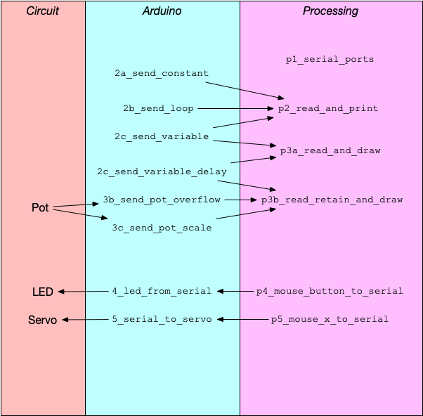

# Sending Single Numeric Values between Arduino and Processing

This folder contains two sub-folders:

- `arduino_to_processing` contains examples that send an value from the Arduino
  to Processing
- `processing_to_arduino` contains examples that send a value from Processing to
  the Arduino

## File Names

Within each subfolder, folders whose names begin with a number (e.g. `2a_send_constant`) are Arduino sketches. Folders whose names begin with a "p" (e.g. `p2_read_and_print`) are Processing sketches.

Sometimes a single Arduino sketch is used with several Processing sketches, and
a single Processing sketch is used with several Arduino sketches. The numbers
and names are used to align the Arduino and Processing sketches. This is more
easily demonstrated through examples. See the lesson plans below.

## Lesson Plan

### A. Arduino to Processing

1. Run `p1_list_serial_ports` in Processing. This lists the serial ports.
2. Upload `2a_send_constant`. Open the Arduino Serial Monitor to display the
   repeated `A`s.
3. Run `p2_read_and_print`. It will display an error that the Serial Monitor is
   busy. Close the Arduino Serial Monitor, and try again. Observe the repeated
   number in the console.
4. Upload `2b_send_loop`. Observe that the number changes in the Processing
   console.
5. Question: how to eliminate the `for` loop, and change it so that instead
   `loop()` sends a 0 the first time that it is called, then a 1, etc. The
   answer is in `2c_send_variable`. Observe (in the Processing console) that the
   number progresses from …, 253, 254, 255 back to 0, 1, 2, …. Why is this?
6. Run `p3a_read_and_draw`, to display a circle whose radius is driven by the
   Arduino. (We could also use `map` to scale the circle to the size of the
   canvas.)
7. Add a `delay(100)` to the Arduino sketch. (This is `3a_send_variable_delay`.)
   Why does the circle in the Processing sketch flicker? How can this be fixed?
   (The answer is in `p3b_read_retain_and_draw`).
8. Upload `3b_send_pot_overflow`. Now the pot that is connected to the Arduino
   controls the size of the Processing circle. Why does the size reset four
   times as your turn the pot all the way?
9. Upload `3c_send_pot_scaled`. Now one revolution of the pot changes the size
   for smallest to largest. We could have used `map` instead of dividing by
   four.

### B. Processing to Arduino

1. Upload `4_led_from_serial` and run `p4_mouse_button_to_serial`. Press the
   mouse button over the canvas to light the LED.
2. Upload `5_serial_to_servo` and run `p5_mouse_x_to_serial`. Move the mouse
   left and right across the canvas to control the servo angle. Note the use of
   `map` in both the Arduino and the Processing sketch. Processing uses `map` to
   make a value in the range 0…255. The Arduino uses `map` to turn this value
   into a servo angle in the range 0…180. Questions: (1) Why not have Processing
   send `mouseX` directly? (2) Why not have Processing compute a value 0…180,
   instead of making the Arduino do this?
